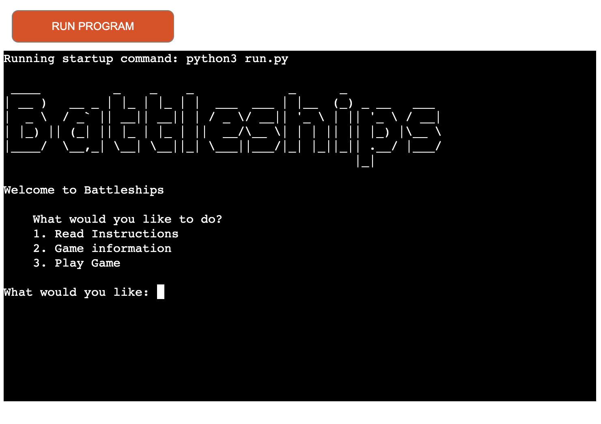

# Battleships

Battleships is a classic two-player. You will play the computer, each having 5 ships of varying sizes. The first to hit all 5 ships is the winner. 
This version is a terminal based game. You'll view 2 grids, a tracking board to see where you have fired and a ship position grid for your ships.

## Live Game

The live game can be seen here:
https://battleship-project3-a-133f293668e9.herokuapp.com/

## Research

I got the information on the game from https://en.wikipedia.org/wiki/Battleship_(game) and https://battleship.fandom.com/wiki/Battleship_(game)

- 1. Read Instructions
    - Battleships is a classic two-player. You will play the computer and each having 5 ships of varying sizes. The first to hit all 5 ships is the winner. You will see 2 grids, a tracking board and a ships position board. Both boards update with a ‘X’ for a hit and a ‘O’ for a miss. The tracking board shows if you hit the computer ship. The ship position board will show if the computer has hit or missed your ship. 
    Players take turns to try to guess the locations of the other player's ships by calling out coordinates (e.g., A3, B7) on the grid. The goal is to sink all of the opponent's ships before they sink yours.

- 2. Game Information
    - Battleship is a strategy type guessing game for two players. It is played on a grid on which each player's fleet of warships are marked. The locations of the fleets are concealed from the other player. Players alternate turns taking shots at coordinates (e.g. A1, B5) at the other player's ships, and the objective of the game is to destroy the opposing player's fleet.

## Design
I used Lucidchats to design a flowchart to map out how the game would operate. [Lucidchart](https://www.lucidchart.com/)
The chart was a referance when writing the code.

## Setting Up the Game:

- Function 1, Intro
    - intro page with 3 options. 
    - 1. Read instructions, 2. Game information and 3. Play Game
    - The options would display after the player chooses 1 and 2. Game would only start when the player chooses option 3
    - Create a grid for each player.
    - Define the size and number of ships for each player (e.g., one 5-cell ship, two 4-cell ships, etc.).
    - Place the ships on the grid for each player. This can be done randomly or manually.
    - Input name: if the input is empty you’ll get an invalid message

- Function 2, create a grid. 
    - After research on the original game I used a 9x9 grid. 9 row and 9 columns. board size can be changed if required as the sizes are constants called BOARD_SIZE_X and BOARD_SIZE_Y. 
    - This function will be used to create 4 boards. 1 each for the computer and players ship positions and 1 each for the computer and players shots.

- Function 3. Print board
    - Two boards are printed. They take there parameters of the player_shot (tracking board) and player_board (ship position).

- Function 3, place ships. 
    - The 5 ships of varying sizes are placed on the board, both horizontal and vertical. With random orientation and position on the grid. 
    - The ships are given a grey colour to match the original game and a letter to indicate what type of ship it is. e.g. ’S’ would be a submarine.

- Function 4, players turn.
    - The computers board is checked to see if there is a ship at those coordinates and updates the board with a X for hit or O for miss. 
    - There is also a printed message.

- Function 5, computers turn.
    - The player board is checked to see if there is a ship at those coordinates and updates the board with a X for hit or O for miss. 
    - There is also a printed message.

- Function 6, check game over.
    - The counter starts at 0 and when it reaches the constant of TOTAL_AREA_OF_ALL_SHIPS (sum of all ships) the game finishes.

- Function 7, main. 
    - 1, intro
    - 2, 4 board are created to track hit and miss. 
    - 3, Place ship function is called for player board and computer board.
    - 4, while play_game is true, do the following
	    - print the board for the player to see, player_shot (tracking board) and player_board (ship 	position).
	    - player turn and update hit and miss
	    - check game over on on computer board. if so you win
	    - time.sleep(1) 1 second before moving on to computers turn
	    - Computers turn and update hit and miss
	    - check game over on on player board. if so you loose

# UX Design

- Intro to the game.
    - [ASCII art](https://pypi.org/project/art/)
    I used ASCII art to print the title of the game “Battleship”
    

- Colours within the game play
    - [Colorama](https://pypi.org/project/colorama/)
    Colorama was used a number of times for UX design
    - Error text red, indicating there was an error 
    - Hit or Miss. I used a red background for a hit and a blue background for a miss, for both the tracking boards (showing where the played had shot) and player ship positions (showing if the computer had hit the players ship). 
    - Red background with an ‘X’ for a hit or blue background with a ‘O’ for miss. 
    - Text for hit and miss. I used the same red and blue backgrounds for the text that was printed to the terminal after the players turn and computers turn
    

- time.sleep()
    - After player shot and received the information on whether it was a hit or miss, I wanted a delay of 1 second so the player could take it in before been distracted by the to grids again.
    

## Manual Testing

- Game loads with link
- Options 1, 2, 3. game should only start if 3 is input
    - Read Instructions displays instructions when input is 1. 3 options appear again
    - Game information displays correctly when input is 2. 3 options appear again
    - Game starts when input is 3
    - When input is anything other then 1,2,3. an error message is printed. 3 options appear again
    
- Name input: 

## Automated Testing

- The code was passed through the Code Institute Python Linter without any errors

## Deployment

- Heroku
    - On the heroku dashboard, click "New" and select "Create new app"
    - Input a name for the app
    - Select Europe for the region
    - Press the button Create app
    - Next choose "Settings" from the tab above
    - Click "Reveal Config Vars
    - Input CREDS and your file name
    - Below this you'll "Add buildpack", heroku/python first and heroku/nodejs second. Make sure it is in this order.
    - From the tabs above, select "Deploy"
    - Select "GitHub"
    - Select the "Connect to GitHub" button
    - Find your GitHub repository with the search bar and press connect
    - Finally click "Deploy Branch"

## Credits and resources 
    - Code institute: Python code and walk-through project 
    - Mentor Support: Spencer Barriball
    - Tutor Support: Tutors at Code institute
    - Random randint() function in Python: [Random function](https://www.geeksforgeeks.org/python-randint-function/)
    - [string .join()](https://www.geeksforgeeks.org/python-string-join-method/) 
    - [W3schools](https://www.w3schools.com/python/ref_string_join.asp)
    - W3schools [.strip()](https://www.w3schools.com/python/ref_string_strip.asp) takes out any space before or after.
    - W3schools [.items()](https://www.w3schools.com/python/ref_dictionary_items.asp) view object, key-value pairs
    - W3school [.ord()](https://www.w3schools.com/python/ref_func_ord.asp) return the number that represents the letter
    - realpython.com how to add delay in your code. import time,  running  time.sleep()
    - Caleb Curry [python](https://www.youtube.com/watch?v=s3IvdkCq2_c&list=PLM5gEw77Ulp6NS27tsxG82WYwFzqP93nh&index=7)
    - [TechwithTim](https://www.youtube.com/@TechWithTim)
    - [Colorama](https://pypi.org/project/colorama/)
    - [ASCII art](https://pypi.org/project/art/)

## Content

    - All text was written by the developer, Andrew O'Dwyer
    - Photoshop was used to crop and stitch images together for the read me.
